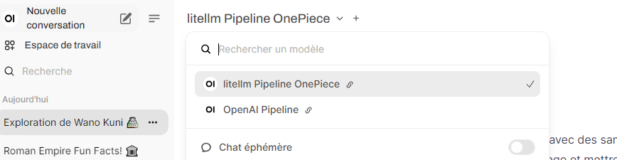
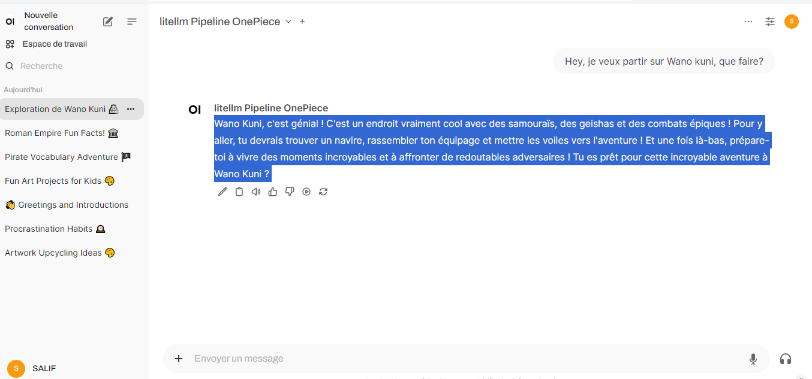

## Setup

1. **Clone the Repository**
   ```bash
   git clone https://github.com/sawadogosalif/openwebui.git
   cd openwebui
   ```

2. **Configure Environment Variables**
   Update a `default.env` file in the root directory with the following variables as you want.

3. **Build and Run Services**
   ```bash
   docker-compose --env-file default.env up -d
   ```
## Update for mardown rendering to keep in mind 
https://github.com/open-webui/pipelines/issues/270
https://github.com/open-webui/open-webui/discussions/11083
## Ref :
+ https://zohaib.me/extending-openwebui-using-pipelines/
+ https://ikasten.io/2024/06/03/getting-started-with-openwebui-pipelines/

## Interface



